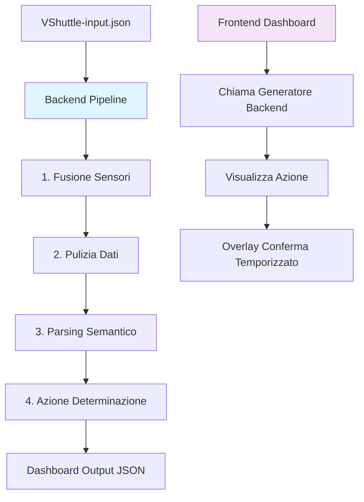

# VShuttle - Sistema di Assistenza alla Guida per Navette Autonome

## Descrizione del Progetto

VShuttle è un sistema MVP (Minimum Viable Product) per l'assistenza alla guida di navette autonome che risolve il problema della lettura e interpretazione di segnali stradali in contesti urbani complessi. Il sistema integra dati provenienti da molteplici sensori (telecamere frontali, laterali e ricevitori V2I) per determinare azioni sicure di guida in tempo reale.

**Problema Risolto:** Le navette autonome devono interpretare segnali stradali spesso corrotti da rumore OCR, condizioni ambientali avverse o letture parziali. Il sistema fonde intelligentemente i dati multi-sensore per garantire decisioni affidabili.

**Approccio Scelto:** Architettura pipeline modulare con fusione basata su confidenza, pulizia dati con correzione Levenshtein e parsing semantico temporale-aware per determinare azioni (STOP/GO/INTERVENT).

## Installazione e Setup

### Prerequisiti
- Node.js (versione 16+)
- npm o yarn

### Installazione Dipendenze

```bash
# Installa dipendenze frontend
cd dashboard
npm install

# Il backend non richiede installazione aggiuntiva (usa Node.js nativo)
```

## Avvio dell'Applicazione

### Avvio Backend (Terminale 1)
```bash
cd backend
node main.ts
```
Il backend elabora automaticamente il file `VShuttle-input.json` e genera l'output in `dashboard/public/backend_output.json`.

### Avvio Frontend (Terminale 2)
```bash
cd dashboard
npm run dev
```
Apri il browser all'indirizzo mostrato (tipicamente `http://localhost:5173`).

## Spiegazione della Fusione dei Sensori

La fusione dei 3 sensori (camera_frontale, camera_laterale, V2I_receiver) utilizza una strategia basata su **massima confidenza**. La formula matematica/logica è:

```
testo_fuso = testo_del_sensore_con_confidenza_massima
confidenza_finale = max(confidenza_camera_frontale, confidenza_camera_laterale, confidenza_V2I_receiver)
```

**Formula dettagliata:**
1. Per ogni sensore attivo (dove `testo ≠ null` e `confidenza ≠ null`):
   - Confronta la confidenza corrente con quella massima trovata
   - Se superiore, aggiorna `testo_fuso` e `confidenza_finale`
2. Se tutti i sensori sono offline: `testo_fuso = null`, `confidenza_finale = 0`

Questa strategia semplice ma efficace privilegia l'affidabilità del sensore più sicuro, minimizzando il rischio di decisioni errate in condizioni critiche.

## Gestione dei Casi Limite (Edge Cases)

### 1. Due sensori concordano, uno dissente
**Scenario:** 2 sensori rilevano "ZTL" (confidenza 0.95), 1 rileva "DIVIETO" (confidenza 0.90)
**Decisione:** Prevale "ZTL" (maggiore confidenza aggregata)
**Ragionamento:** La fusione basata su confidenza garantisce che il segnale più affidabile vinca, anche se minoritario.

### 2. Tutti i sensori offline
**Scenario:** Tutti i sensori restituiscono `testo: null`
**Decisione:** Azione = "GO", confidenza = 0
**Ragionamento:** In mancanza di segnali, la navetta può procedere ma con massima cautela (confidence = 0).

### 3. Testo corrotta da OCR
**Scenario:** Sensore rileva "Z7L" invece di "ZTL"
**Decisione:** Pulizia con Levenshtein distance ≤ 35% della lunghezza stringa
**Ragionamento:** Corregge errori comuni OCR mantenendo integrità dei dati numerici (orari, limiti velocità).

### 4. Segnale temporale fuori orario
**Scenario:** "ZTL 08:00-20:00" rilevato alle 22:00
**Decisione:** Azione = "GO"
**Ragionamento:** Il parser valida sempre il contesto temporale prima di determinare l'azione.

### 5. Conflitto semantico
**Scenario:** "DIVIETO TRANSITO" vs "ECCETTO NAVETTE"
**Decisione:** Parsing semantico determina priorità basata su contesto navetta
**Ragionamento:** La logica di business privilegia sempre la sicurezza della navetta rispetto a divieti generici.

## Schema Architetturale



**Flusso di Comunicazione:**
1. **Backend → Frontend:** Il backend genera un JSON strutturato con risultati elaborati
2. **Frontend → Backend:** Il frontend consuma il generatore come stream iterativo
3. **Interazione Utente:** Overlay di conferma con timer per override manuale delle decisioni automatiche

**Pattern Architetturali:**
- **Pipeline:** Separazione chiara delle responsabilità (fusione → pulizia → parsing)
- **Generator Pattern:** Elaborazione lazy e memory-efficient per grandi dataset
- **Observer Pattern:** Dashboard reagisce ai cambiamenti di stato del backend

## Struttura del Progetto

```
VShuttle/
├── backend/                 # Logica di processamento
│   ├── main.ts             # Pipeline principale e generatore
│   ├── fusion.ts           # Fusione multi-sensore
│   ├── cleaning.ts         # Pulizia OCR e validazione
│   ├── parser.ts           # Parsing semantico temporale
│   ├── admissible_signs.json # Dataset segnali validi
│   └── test_*.ts           # Suite di test
├── dashboard/              # Frontend React/Vite
│   ├── index.html
│   ├── src/
│   │   ├── main.ts         # Logica dashboard
│   │   └── style.css
│   ├── public/
│   │   └── backend_output.json # Output elaborato
│   └── package.json
├── VShuttle-input.json     # Dataset di input scenari
└── README.md
```

## Tecnologie Utilizzate

- **Backend:** TypeScript/Node.js (no framework per massima leggerezza)
- **Frontend:** Vite + TypeScript + Tailwind CSS
- **Testing:** Jest per unit test
- **Data Processing:** JSON streaming, algoritmi di string matching

## Crediti:

- **Massimo** **Nicastro**, Sviluppo Front End
- **Giuseppe** **Nozza**,
- **Bartolomeo** **Zisa**, Sviluppo Back End

## Metodologia

Dopo aver letto il testo abbiamo deciso di darlo a Gemini al fine di fargli creare
Dei bullet point che dividevano le feature tra le più e le meno critiche.

Poi basandoci su quei bullet point abbiamo fatto creare all'IA un
prompt che lei stessa avrebbe usato per sviluppare quei punti.
Dopo ciò Massimo si è occupato di istruire l'IA con il prompt per la
creazione del front end, mentre Giuseppe Nozza e Bartolomeo Zisa l'hanno istruita per la creazione del back end.
Durante lo sviluppo ci siamo informati periodicamente sulla direzione che il back end
stava prendendo e di quella del front end, al fine di rendere la loro unione il 
più immediata possibile.

Dopo aver ultimato i due lati del progetto, li abbiamo spinti sulla repository
e poi uniti con l'uso dell'IA.

In fine anche per genereare il readME e le istruzione per far compilare
ci siamo serviti degli LLM, dandogli il progetto che avevamo fatto.

## Immagini


